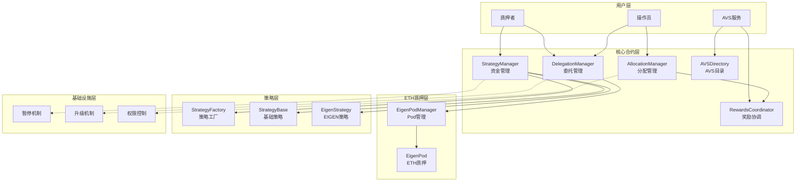
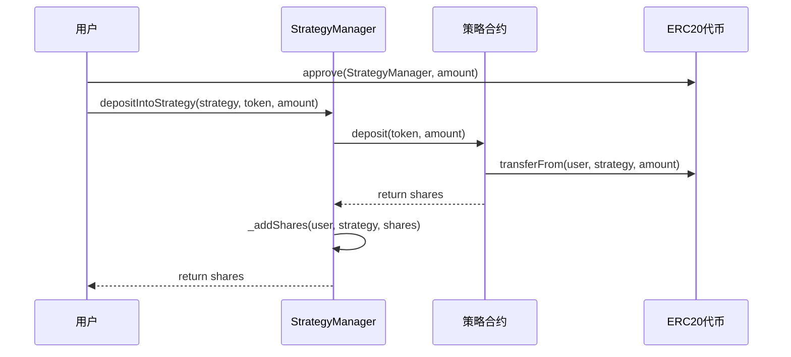
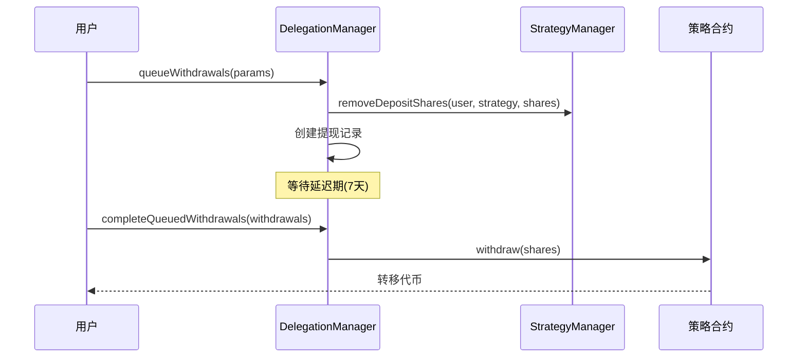
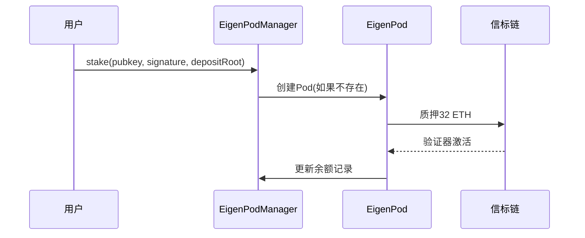

# EigenLayer 合约架构深度分析

## 📋 目录
1. [项目概述](#项目概述)
2. [架构图](#架构图)
3. [目录结构](#目录结构)
4. [核心合约详解](#核心合约详解)
5. [关键函数实现](#关键函数实现)
6. [数据流分析](#数据流分析)
7. [安全机制](#安全机制)
8. [最佳实践](#最佳实践)

## 项目概述

EigenLayer 是以太坊生态中的再质押协议，允许用户将已质押的 ETH 或流动性质押代币重复质押到其他区块链应用（AVS - Actively Validated Services），以获取额外收益。其核心理念是"复用安全性"，降低新项目构建信任网络的成本。

### 核心特性
- **再质押机制**: 复用以太坊主网的安全性
- **模块化设计**: 各组件职责清晰，便于升级和维护
- **多策略支持**: 支持多种代币和质押策略
- **延迟提现**: 保护网络安全的关键机制
- **灵活奖励**: 多种奖励分发机制

## 架构图



## 目录结构

```
contracts/
├── core/                          # 核心合约
│   ├── StrategyManager.sol        # 策略管理，资金进出入口
│   ├── DelegationManager.sol      # 委托管理，操作员注册
│   ├── AllocationManager.sol      # 分配管理，AVS集成
│   ├── AVSDirectory.sol           # AVS目录管理
│   ├── RewardsCoordinator.sol     # 奖励分发协调
│   └── ReleaseManager.sol         # 版本发布管理
├── interfaces/                    # 接口定义
│   ├── IStrategyManager.sol       # 策略管理接口
│   ├── IDelegationManager.sol     # 委托管理接口
│   ├── IAllocationManager.sol     # 分配管理接口
│   └── ...                        # 其他接口
├── strategies/                    # 策略实现
│   ├── StrategyFactory.sol        # 策略工厂
│   ├── StrategyBase.sol           # 基础策略
│   └── EigenStrategy.sol          # EIGEN代币策略
├── pods/                          # ETH质押相关
│   ├── EigenPodManager.sol        # Pod管理器
│   └── EigenPod.sol               # 单个Pod实现
├── libraries/                     # 工具库
│   ├── BeaconChainProofs.sol      # 信标链证明
│   ├── SlashingLib.sol            # 削减逻辑
│   └── OperatorSetLib.sol         # 操作员集合
├── permissions/                   # 权限控制
│   ├── Pausable.sol               # 暂停机制
│   └── PermissionController.sol   # 权限控制器
├── token/                         # 代币合约
│   ├── Eigen.sol                  # EIGEN代币
│   └── BackingEigen.sol           # bEIGEN代币
└── multichain/                    # 多链支持
    ├── CrossChainRegistry.sol     # 跨链注册
    └── ...                        # 其他多链组件
```

## 核心合约详解

### 1. 核心管理合约
**StrategyManager.sol**: 资金进出的主要入口，管理不同策略的存款和策略白名单
**DelegationManager.sol**: 处理操作员注册、质押者委托和取消委托
**AllocationManager.sol**: 管理操作员分配、AVS 注册和操作员集合创建
**AVSDirectory.sol**: 管理 AVS 元数据更新和操作员注册状态
**RewardsCoordinator.sol**: 处理 ERC20 奖励分发和收益领取

### 2. ETH 质押相关
**EigenPodManager.sol**: 管理 EigenPod 的创建和管理
**EigenPod.sol**: 重新质押信标链 ETH 的核心实现

### 3. 策略系统
**StrategyFactory.sol**: 部署新策略的工厂合约
**StrategyBase.sol**: 策略的基础实现
**EigenStrategy.sol**: 兼容 EIGEN 和 bEIGEN 代币的策略实现
## 关键函数实现

### 1. StrategyManager 核心函数

#### depositIntoStrategy - ERC20代币存款
```solidity
/**
 * @notice 将ERC20代币存入指定策略
 * @param strategy 目标策略合约
 * @param token 要存入的ERC20代币
 * @param amount 存入数量
 * @return depositShares 获得的策略份额
 */
function depositIntoStrategy(
    IStrategy strategy,
    IERC20 token,
    uint256 amount
) external onlyWhenNotPaused(PAUSED_DEPOSITS) nonReentrant returns (uint256 depositShares) {
    depositShares = _depositIntoStrategy(msg.sender, strategy, token, amount);
}

// 内部实现
function _depositIntoStrategy(
    address staker,
    IStrategy strategy,
    IERC20 token,
    uint256 amount
) internal onlyStrategiesWhitelistedForDeposit(strategy) returns (uint256 depositShares) {
    // 1. 验证策略是否在白名单中
    // 2. 从用户账户转移代币到策略合约
    // 3. 调用策略合约的deposit函数获取份额
    // 4. 更新用户的存款份额记录
    depositShares = strategy.deposit(token, amount);
    _addShares(staker, strategy, depositShares);
    
    emit Deposit(staker, token, strategy, depositShares);
}
```

#### removeDepositShares - 移除存款份额
```solidity
/**
 * @notice 移除质押者的存款份额（仅DelegationManager可调用）
 * @param staker 质押者地址
 * @param strategy 策略合约
 * @param depositSharesToRemove 要移除的份额数量
 */
function removeDepositShares(
    address staker,
    IStrategy strategy,
    uint256 depositSharesToRemove
) external onlyDelegationManager nonReentrant returns (uint256) {
    return _removeDepositShares(staker, strategy, depositSharesToRemove);
}
```

### 2. DelegationManager 核心函数

#### registerAsOperator - 注册为操作员
```solidity
/**
 * @notice 注册为EigenLayer操作员
 * @param initDelegationApprover 委托批准者地址
 * @param allocationDelay 分配延迟时间
 * @param metadataURI 元数据URI
 */
function registerAsOperator(
    address initDelegationApprover,
    uint32 allocationDelay,
    string calldata metadataURI
) external nonReentrant {
    // 1. 检查调用者未被委托
    require(!isDelegated(msg.sender), ActivelyDelegated());
    
    // 2. 设置分配延迟
    allocationManager.setAllocationDelay(msg.sender, allocationDelay);
    
    // 3. 设置委托批准者
    _setDelegationApprover(msg.sender, initDelegationApprover);
    
    // 4. 操作员委托给自己
    _delegate(msg.sender, msg.sender);
    
    emit OperatorRegistered(msg.sender, initDelegationApprover);
    emit OperatorMetadataURIUpdated(msg.sender, metadataURI);
}
```

#### delegateTo - 委托给操作员
```solidity
/**
 * @notice 将质押委托给指定操作员
 * @param operator 操作员地址
 * @param approverSignatureAndExpiry 批准者签名和过期时间
 * @param approverSalt 批准者盐值
 */
function delegateTo(
    address operator,
    SignatureWithExpiry memory approverSignatureAndExpiry,
    bytes32 approverSalt
) public nonReentrant {
    // 1. 检查调用者未被委托
    require(!isDelegated(msg.sender), ActivelyDelegated());
    // 2. 检查操作员已注册
    require(isOperator(operator), OperatorNotRegistered());
    
    // 3. 验证批准者签名（如果需要）
    _checkApproverSignature({
        staker: msg.sender,
        operator: operator,
        signature: approverSignatureAndExpiry,
        salt: approverSalt
    });
    
    // 4. 执行委托
    _delegate(msg.sender, operator);
}
```

#### queueWithdrawals - 排队提现
```solidity
/**
 * @notice 将提现请求加入队列
 * @param params 提现参数数组
 * @return withdrawalRoots 提现根哈希数组
 */
function queueWithdrawals(
    QueuedWithdrawalParams[] calldata params
) external onlyWhenNotPaused(PAUSED_ENTER_WITHDRAWAL_QUEUE) nonReentrant returns (bytes32[] memory) {
    bytes32[] memory withdrawalRoots = new bytes32[](params.length);
    address operator = delegatedTo[msg.sender];
    
    for (uint256 i = 0; i < params.length; i++) {
        // 1. 验证输入参数
        require(params[i].strategies.length == params[i].depositShares.length, InputArrayLengthMismatch());
        
        // 2. 获取削减因子
        uint256[] memory slashingFactors = _getSlashingFactors(msg.sender, operator, params[i].strategies);
        
        // 3. 移除份额并创建提现记录
        withdrawalRoots[i] = _removeSharesAndQueueWithdrawal({
            staker: msg.sender,
            operator: operator,
            strategies: params[i].strategies,
            depositSharesToWithdraw: params[i].depositShares,
            slashingFactors: slashingFactors,
            withdrawer: params[i].withdrawer
        });
    }
    
    return withdrawalRoots;
}
```

### 3. AllocationManager 核心函数

#### slashOperator - 削减操作员
```solidity
/**
 * @notice 削减操作员的质押
 * @param avs AVS地址
 * @param params 削减参数
 * @return slashId 削减ID和削减的份额数组
 */
function slashOperator(
    address avs,
    SlashingParams calldata params
) external onlyWhenNotPaused(PAUSED_OPERATOR_SLASHING) checkCanCall(avs) returns (uint256, uint256[] memory) {
    // 1. 验证操作员集合存在
    OperatorSet memory operatorSet = OperatorSet(avs, params.operatorSetId);
    require(_operatorSets[operatorSet.avs].contains(operatorSet.id), InvalidOperatorSet());
    
    // 2. 验证操作员可被削减
    require(isOperatorSlashable(params.operator, operatorSet), OperatorNotSlashable());
    
    // 3. 执行削减
    return _slashOperator(params, operatorSet);
}
```

### 4. EigenPodManager 核心函数

#### createPod - 创建EigenPod
```solidity
/**
 * @notice 为调用者创建新的EigenPod
 * @return pod地址
 */
function createPod() external onlyWhenNotPaused(PAUSED_NEW_EIGENPODS) nonReentrant returns (address) {
    require(!hasPod(msg.sender), EigenPodAlreadyExists());
    
    // 使用CREATE2部署Pod
    IEigenPod pod = _deployPod();
    
    return address(pod);
}
```

#### stake - 质押ETH
```solidity
/**
 * @notice 质押32 ETH到信标链
 * @param pubkey 验证器公钥
 * @param signature 存款签名
 * @param depositDataRoot 存款数据根
 */
function stake(
    bytes calldata pubkey,
    bytes calldata signature,
    bytes32 depositDataRoot
) external payable onlyWhenNotPaused(PAUSED_NEW_EIGENPODS) nonReentrant {
    IEigenPod pod = ownerToPod[msg.sender];
    
    // 如果没有Pod则创建一个
    if (address(pod) == address(0)) {
        pod = _deployPod();
    }
    
    // 调用Pod的stake函数
    pod.stake{value: msg.value}(pubkey, signature, depositDataRoot);
}
```

### 5. RewardsCoordinator 核心函数

#### createAVSRewardsSubmission - 创建AVS奖励提交
```solidity
/**
 * @notice AVS提交奖励分发
 * @param rewardsSubmissions 奖励提交数组
 */
function createAVSRewardsSubmission(
    RewardsSubmission[] calldata rewardsSubmissions
) external onlyWhenNotPaused(PAUSED_AVS_REWARDS_SUBMISSION) nonReentrant {
    for (uint256 i = 0; i < rewardsSubmissions.length; i++) {
        RewardsSubmission calldata rewardsSubmission = rewardsSubmissions[i];
        uint256 nonce = submissionNonce[msg.sender];
        
        // 1. 计算提交哈希
        bytes32 rewardsSubmissionHash = keccak256(abi.encode(msg.sender, nonce, rewardsSubmission));
        
        // 2. 验证提交
        _validateRewardsSubmission(rewardsSubmission);
        
        // 3. 记录提交
        isAVSRewardsSubmissionHash[msg.sender][rewardsSubmissionHash] = true;
        submissionNonce[msg.sender] = nonce + 1;
        
        // 4. 转移代币
        rewardsSubmission.token.safeTransferFrom(msg.sender, address(this), rewardsSubmission.amount);
        
        emit AVSRewardsSubmissionCreated(msg.sender, nonce, rewardsSubmissionHash, rewardsSubmission);
    }
}
```
## 资金流转机制

### 充值流程图


### 提现流程图


### ETH质押流程图


## 安全机制详解

### 1. 削减机制 (Slashing)

#### 削减触发条件
- **双重签名**: 验证器在同一高度签署多个区块
- **环绕投票**: 验证器进行环绕式投票
- **AVS违规**: 违反特定AVS的服务规则

#### 削减执行流程
```solidity
// 削减操作员示例
function slashOperator(
    address avs,
    SlashingParams calldata params
) external returns (uint256 slashId, uint256[] memory slashedShares) {
    // 1. 验证削减权限
    require(hasSlashingPermission(msg.sender, avs), "No permission");
    
    // 2. 计算削减金额
    uint256[] memory slashingFactors = _calculateSlashingFactors(params);
    
    // 3. 执行削减
    slashedShares = _executeSlashing(params.operator, slashingFactors);
    
    // 4. 分发削减资金
    _distributeSlashedFunds(slashedShares, params.recipient);
    
    emit OperatorSlashed(params.operator, avs, slashedShares);
}
```

### 2. 访问控制机制

#### 角色权限矩阵
| 角色 | StrategyManager | DelegationManager | AllocationManager | EigenPodManager |
|------|----------------|-------------------|-------------------|------------------|
| Owner | 全部权限 | 全部权限 | 全部权限 | 全部权限 |
| Pauser | 暂停功能 | 暂停功能 | 暂停功能 | 暂停功能 |
| Unpauser | 恢复功能 | 恢复功能 | 恢复功能 | 恢复功能 |
| StrategyWhitelister | 策略白名单管理 | - | - | - |
| AllocationManager | - | 分配管理 | - | - |

### 3. 经济安全模型

#### 安全预算计算
```solidity
/**
 * @notice 计算操作员的总安全预算
 * @param operator 操作员地址
 * @return totalSecurity 总安全预算(ETH等价值)
 */
function calculateOperatorSecurity(address operator) public view returns (uint256 totalSecurity) {
    // 1. 计算ETH质押价值
    uint256 ethStaked = eigenPodManager.podOwnerShares(operator);
    
    // 2. 计算ERC20代币质押价值
    IStrategy[] memory strategies = strategyManager.getOperatorStrategies(operator);
    for (uint256 i = 0; i < strategies.length; i++) {
        uint256 shares = delegationManager.operatorShares(operator, strategies[i]);
        uint256 tokenValue = _convertToETHValue(strategies[i], shares);
        totalSecurity += tokenValue;
    }
    
    return totalSecurity;
}
```

🔒 安全机制
削减保护
延迟提现: 确保恶意行为可在提现完成前被削减
缩放因子: 通过 DepositScalingFactor 跟踪削减历史
操作员集合: 支持细粒度的削减控制
访问控制
暂停机制: 关键功能可被暂停以应对紧急情况
权限控制: 不同角色有不同的操作权限
签名验证: 重要操作需要 EIP-712 签名验证

## AVS集成指南

### 1. AVS开发模板

```solidity
// AVS服务合约示例
contract ExampleAVS {
    IAVSDirectory public immutable avsDirectory;
    IAllocationManager public immutable allocationManager;
    
    // 操作员集合ID
    uint32 public constant OPERATOR_SET_ID = 0;
    
    constructor(
        address _avsDirectory,
        address _allocationManager
    ) {
        avsDirectory = IAVSDirectory(_avsDirectory);
        allocationManager = IAllocationManager(_allocationManager);
    }
    
    /**
     * @notice 操作员注册到AVS
     */
    function registerOperator(address operator) external {
        // 1. 验证操作员已在EigenLayer注册
        require(avsDirectory.isOperatorRegistered(operator), "Operator not registered");
        
        // 2. 注册到操作员集合
        allocationManager.registerForOperatorSet(
            operator,
            OperatorSet(address(this), OPERATOR_SET_ID)
        );
        
        emit OperatorRegistered(operator);
    }
    
    /**
     * @notice 提交服务证明并分发奖励
     */
    function submitProofAndReward(
        bytes calldata proof,
        address[] calldata operators,
        uint256[] calldata rewards
    ) external {
        // 1. 验证服务证明
        require(_verifyProof(proof), "Invalid proof");
        
        // 2. 分发奖励
        _distributeRewards(operators, rewards);
    }
}
```

### 2. AVS部署清单

1. **合约部署**
   - 部署AVS服务合约
   - 在AVSDirectory注册AVS
   - 配置操作员集合参数

2. **运营配置**
   - 设置服务参数和SLA
   - 配置奖励分发机制
   - 建立监控和告警系统

3. **操作员招募**
   - 发布操作员招募信息
   - 设置最低质押要求
   - 建立操作员评估机制

🏭 策略管理
策略工厂
自动部署: StrategyFactory.sol 可为任意 ERC20 代币部署策略
白名单管理: 自动将新策略添加到 StrategyManager 白名单
黑名单机制: 支持禁止特定代币创建策略
策略类型
基础策略: 处理单一底层代币的标准策略
EIGEN 策略: 支持 EIGEN/bEIGEN 代币转换的特殊策略
信标链策略: 虚拟策略，用于 ETH 质押

