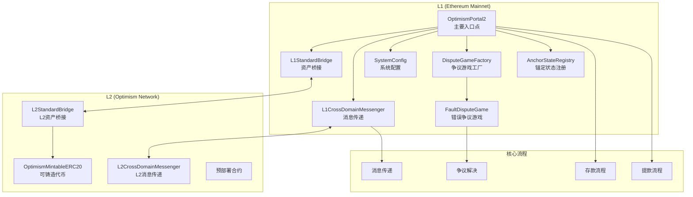

# Optimism Layer 2 项目架构分析文档

## 项目概述

Optimism 是一个基于 Optimistic Rollup 技术的以太坊 Layer 2 扩容解决方案。该项目通过将交易执行移至 L2，同时保持与以太坊主网的安全性和去中心化特性，实现了高吞吐量和低成本的交易处理。

## 架构图



## 目录结构分析

### 根目录结构
```
optimistic/
├── book/                          # 文档和说明书
├── deploy-config/                 # 部署配置文件
├── deploy-config-periphery/       # 外围部署配置
├── deployments/                   # 部署产物
├── interfaces/                    # Solidity接口定义
│   ├── L1/                       # L1相关接口
│   ├── L2/                       # L2相关接口
│   ├── cannon/                   # Cannon相关接口
│   ├── dispute/                  # 争议系统接口
│   ├── governance/               # 治理接口
│   ├── legacy/                   # 遗留接口
│   ├── safe/                     # 安全相关接口
│   ├── universal/                # 通用接口
│   └── vendor/                   # 第三方接口
├── scripts/                      # 脚本文件
├── snapshots/                    # 快照文件
├── src/                          # 核心合约源码
└── test/                         # 测试文件
```

### 核心合约目录 (src/)
```
src/
├── L1/                           # L1层合约
│   ├── OptimismPortal2.sol      # 主要入口点合约
│   ├── L1StandardBridge.sol     # L1标准桥接合约
│   ├── L1CrossDomainMessenger.sol # L1跨域消息传递
│   ├── SystemConfig.sol         # 系统配置合约
│   ├── ETHLockbox.sol           # ETH锁定盒
│   ├── SuperchainConfig.sol     # 超级链配置
│   └── ...
├── L2/                           # L2层合约
│   ├── L2StandardBridge.sol     # L2标准桥接合约
│   ├── L2CrossDomainMessenger.sol # L2跨域消息传递
│   ├── OptimismMintableERC20.sol # 可铸造ERC20代币
│   └── ...
├── dispute/                      # 争议解决系统
│   ├── DisputeGameFactory.sol   # 争议游戏工厂
│   ├── FaultDisputeGame.sol     # 错误争议游戏
│   └── lib/                     # 争议系统库
├── universal/                    # 通用合约
│   ├── CrossDomainMessenger.sol # 跨域消息传递基类
│   └── StandardBridge.sol       # 标准桥接基类
├── libraries/                    # 工具库
└── governance/                   # 治理相关合约
```

## 核心合约架构分析

### 1. OptimismPortal2.sol - 主要入口点

**职责**: L1和L2之间的主要入口点，处理存款和提款交易

**关键状态变量**:
```solidity
// 系统配置合约地址
ISystemConfig public systemConfig;

// 锚定状态注册表
IAnchorStateRegistry public anchorStateRegistry;

// ETH锁定盒
IETHLockbox public ethLockbox;

// 已完成的提款映射
mapping(bytes32 => bool) public finalizedWithdrawals;

// 已证明的提款映射
mapping(bytes32 => ProvenWithdrawal) public provenWithdrawals;
```

**关键函数实现**:

#### depositTransaction - 存款交易
```solidity
/**
 * @notice 将交易存入L2
 * @param _to 目标地址
 * @param _value ETH数量
 * @param _gasLimit Gas限制
 * @param _isCreation 是否为合约创建
 * @param _data 调用数据
 */
function depositTransaction(
    address _to,
    uint256 _value,
    uint64 _gasLimit,
    bool _isCreation,
    bytes memory _data
) public payable {
    // 检查系统未暂停
    _assertNotPaused();
    
    // 验证目标地址不是不安全目标
    if (_isUnsafeTarget(_to)) revert BadTarget();
    
    // 验证Gas限制
    if (_gasLimit < minimumGasLimit(uint64(_data.length))) {
        revert SmallGasLimit();
    }
    
    // 锁定ETH到ethLockbox
    if (msg.value > 0) {
        ethLockbox.lockETH{ value: msg.value }();
    }
    
    // 发出存款事件
    emit TransactionDeposited(
        from,
        _to,
        DEPOSIT_VERSION,
        opaqueData
    );
}
```

#### proveWithdrawalTransaction - 证明提款交易
```solidity
/**
 * @notice 使用争议游戏证明提款交易
 * @param _disputeGameIndex 争议游戏索引
 * @param _outputRootProof 输出根证明
 * @param _withdrawalProof 提款证明
 */
function proveWithdrawalTransaction(
    uint256 _disputeGameIndex,
    Types.OutputRootProof calldata _outputRootProof,
    bytes[] calldata _withdrawalProof
) external {
    // 获取争议游戏
    IDisputeGame game = disputeGameFactory.gameAtIndex(_disputeGameIndex);
    
    // 验证游戏状态
    if (game.status() != GameStatus.DEFENDER_WINS) {
        revert InvalidDisputeGame();
    }
    
    // 验证证明
    _verifyWithdrawalProof(_outputRootProof, _withdrawalProof);
    
    // 记录已证明的提款
    bytes32 withdrawalHash = Hashing.hashWithdrawal(_tx);
    provenWithdrawals[withdrawalHash] = ProvenWithdrawal({
        outputRoot: _outputRootProof.outputRoot,
        timestamp: uint128(block.timestamp),
        l2OutputIndex: uint128(_l2OutputIndex)
    });
    
    emit WithdrawalProven(withdrawalHash, _tx.sender, _tx.target);
}
```

#### finalizeWithdrawalTransaction - 完成提款交易
```solidity
/**
 * @notice 完成提款交易
 * @param _tx 提款交易数据
 */
function finalizeWithdrawalTransaction(
    Types.WithdrawalTransaction memory _tx
) external {
    // 检查系统未暂停
    _assertNotPaused();
    
    bytes32 withdrawalHash = Hashing.hashWithdrawal(_tx);
    
    // 检查提款是否已证明且未完成
    checkWithdrawal(withdrawalHash, _tx);
    
    // 标记为已完成
    finalizedWithdrawals[withdrawalHash] = true;
    
    // 从ethLockbox解锁ETH
    if (_tx.value > 0) {
        ethLockbox.unlockETH(_tx.value);
    }
    
    // 设置L2发送者
    l2Sender = _tx.sender;
    
    // 执行调用
    bool success = SafeCall.callWithMinGas(
        _tx.target,
        _tx.gasLimit,
        _tx.value,
        _tx.data
    );
    
    // 重置L2发送者
    l2Sender = Constants.DEFAULT_L2_SENDER;
    
    emit WithdrawalFinalized(withdrawalHash, success);
}
```

### 2. L1StandardBridge.sol - 资产桥接

**职责**: 处理ETH和ERC20代币在L1和L2之间的桥接

**关键函数实现**:

#### depositETH - ETH存款
```solidity
/**
 * @notice 存入ETH到L2
 * @param _minGasLimit 最小Gas限制
 * @param _extraData 额外数据
 */
function depositETH(uint32 _minGasLimit, bytes calldata _extraData) external payable {
    _initiateETHDeposit(msg.sender, msg.sender, _minGasLimit, _extraData);
}

/**
 * @notice 内部ETH存款实现
 */
function _initiateETHDeposit(
    address _from,
    address _to,
    uint32 _minGasLimit,
    bytes memory _extraData
) internal {
    // 通过messenger发送消息到L2
    messenger.sendMessage{
        value: msg.value
    }(
        address(otherBridge),
        abi.encodeWithSelector(
            StandardBridge.finalizeBridgeETH.selector,
            _from,
            _to,
            msg.value,
            _extraData
        ),
        _minGasLimit
    );
    
    emit ETHDepositInitiated(_from, _to, msg.value, _extraData);
}
```

#### depositERC20 - ERC20代币存款
```solidity
/**
 * @notice 存入ERC20代币到L2
 * @param _l1Token L1代币地址
 * @param _l2Token L2代币地址
 * @param _amount 数量
 * @param _minGasLimit 最小Gas限制
 * @param _extraData 额外数据
 */
function depositERC20(
    address _l1Token,
    address _l2Token,
    uint256 _amount,
    uint32 _minGasLimit,
    bytes calldata _extraData
) external virtual {
    _initiateERC20Deposit(
        _l1Token,
        _l2Token,
        msg.sender,
        msg.sender,
        _amount,
        _minGasLimit,
        _extraData
    );
}
```

### 3. DisputeGameFactory.sol - 争议游戏工厂

**职责**: 创建和管理争议游戏实例

**关键函数实现**:

#### create - 创建争议游戏
```solidity
/**
 * @notice 创建新的争议游戏
 * @param _gameType 游戏类型
 * @param _rootClaim 根声明
 * @param _extraData 额外数据
 * @return proxy_ 创建的争议游戏代理地址
 */
function create(
    GameType _gameType,
    Claim _rootClaim,
    bytes calldata _extraData
) external payable returns (IDisputeGame proxy_) {
    // 获取实现合约
    IDisputeGame impl = gameImpls[_gameType];
    if (address(impl) == address(0)) revert NoImplementation(_gameType);
    
    // 检查初始化保证金
    if (msg.value != initBonds[_gameType]) revert IncorrectBondAmount();
    
    // 获取父区块哈希
    bytes32 parentHash = blockhash(block.number - 1);
    
    // 克隆实现合约
    proxy_ = IDisputeGame(
        address(impl).clone(
            abi.encodePacked(
                msg.sender,
                _rootClaim,
                parentHash,
                _extraData
            )
        )
    );
    
    // 初始化游戏
    proxy_.initialize{ value: msg.value }();
    
    // 计算唯一标识符
    Hash uuid = getGameUUID(_gameType, _rootClaim, _extraData);
    
    // 检查游戏是否已存在
    if (GameId.unwrap(_disputeGames[uuid]) != bytes32(0)) {
        revert GameAlreadyExists(uuid);
    }
    
    // 打包游戏ID
    GameId id = LibGameId.pack(
        _gameType,
        Timestamp.wrap(uint64(block.timestamp)),
        address(proxy_)
    );
    
    // 存储游戏
    _disputeGames[uuid] = id;
    _disputeGameList.push(id);
    
    emit DisputeGameCreated(address(proxy_), _gameType, _rootClaim);
}
```

### 4. CrossDomainMessenger.sol - 跨域消息传递

**职责**: L1和L2之间的消息传递基础设施

**关键函数实现**:

#### sendMessage - 发送消息
```solidity
/**
 * @notice 发送消息到另一条链
 * @param _target 目标地址
 * @param _message 消息内容
 * @param _minGasLimit 最小Gas限制
 */
function sendMessage(
    address _target,
    bytes calldata _message,
    uint32 _minGasLimit
) external payable {
    // 发送消息到另一个messenger
    _sendMessage({
        _to: address(otherMessenger),
        _gasLimit: baseGas(_message, _minGasLimit),
        _value: msg.value,
        _data: abi.encodeWithSelector(
            this.relayMessage.selector,
            messageNonce(),
            msg.sender,
            _target,
            msg.value,
            _minGasLimit,
            _message
        )
    });
    
    emit SentMessage(_target, msg.sender, _message, messageNonce(), _minGasLimit);
    emit SentMessageExtension1(msg.sender, msg.value);
    
    unchecked {
        ++msgNonce;
    }
}
```

#### relayMessage - 中继消息
```solidity
/**
 * @notice 中继来自另一条链的消息
 * @param _nonce 消息随机数
 * @param _sender 发送者地址
 * @param _target 目标地址
 * @param _value ETH数量
 * @param _minGasLimit 最小Gas限制
 * @param _message 消息内容
 */
function relayMessage(
    uint256 _nonce,
    address _sender,
    address _target,
    uint256 _value,
    uint256 _minGasLimit,
    bytes calldata _message
) external payable {
    // 验证调用者是另一个messenger
    if (!_isOtherMessenger()) revert InvalidMessenger();
    
    // 计算消息哈希
    bytes32 versionedHash = Hashing.hashCrossDomainMessage(
        _nonce,
        _sender,
        _target,
        _value,
        _minGasLimit,
        _message
    );
    
    // 检查消息是否已成功执行
    if (successfulMessages[versionedHash]) revert MessageAlreadyRelayed();
    
    // 检查是否有足够的Gas
    if (!hasMinGas(_minGasLimit, gasleft())) revert InsufficientGas();
    
    // 设置跨域消息发送者
    xDomainMsgSender = _sender;
    
    // 执行调用
    bool success = SafeCall.callWithMinGas(
        _target,
        _minGasLimit,
        _value,
        _message
    );
    
    // 重置跨域消息发送者
    xDomainMsgSender = Constants.DEFAULT_L2_SENDER;
    
    if (success) {
        successfulMessages[versionedHash] = true;
        emit RelayedMessage(versionedHash);
    } else {
        failedMessages[versionedHash] = true;
        emit FailedRelayedMessage(versionedHash);
    }
}
```

## 核心流程分析

### 1. 存款流程 (L1 → L2)

1. **用户调用**: 用户在L1上调用 `OptimismPortal2.depositTransaction()` 或 `L1StandardBridge.depositETH()`
2. **资金锁定**: ETH被锁定在 `ETHLockbox` 合约中
3. **事件发出**: 发出 `TransactionDeposited` 事件
4. **L2处理**: L2节点监听事件并在L2上执行相应交易
5. **状态更新**: L2状态得到更新，用户在L2上收到资金

### 2. 提款流程 (L2 → L1)

1. **发起提款**: 用户在L2上调用提款函数
2. **等待挑战期**: 提款需要等待7天挑战期
3. **证明提款**: 用户调用 `proveWithdrawalTransaction()` 提供Merkle证明
4. **完成提款**: 挑战期结束后，用户调用 `finalizeWithdrawalTransaction()` 完成提款
5. **资金释放**: ETH从 `ETHLockbox` 中释放给用户

### 3. 争议解决流程

1. **争议发起**: 当有人质疑L2状态时，可以发起争议游戏
2. **游戏创建**: 通过 `DisputeGameFactory.create()` 创建争议游戏实例
3. **交互式证明**: 参与者通过 `FaultDisputeGame` 进行交互式证明
4. **结果确定**: 游戏结束后确定正确的状态根
5. **奖惩执行**: 正确方获得奖励，错误方失去保证金

## 安全机制

### 1. 欺诈证明系统
- **挑战期**: 7天的挑战窗口期
- **交互式证明**: 通过二分法缩小争议范围
- **经济激励**: 保证金机制确保诚实行为

### 2. 多重验证
- **Merkle证明**: 验证交易包含在L2状态中
- **状态根验证**: 验证L2状态根的正确性
- **Gas限制检查**: 防止Gas相关攻击

### 3. 访问控制
- **角色权限**: 不同角色有不同的操作权限
- **暂停机制**: 紧急情况下可以暂停系统
- **升级控制**: 合约升级需要多重签名

## 总结

Optimism Layer 2 项目是一个复杂而精密的系统，通过以下核心组件实现了高效的Layer 2扩容：

1. **OptimismPortal2**: 作为L1和L2之间的主要网关
2. **StandardBridge**: 提供资产桥接功能
3. **CrossDomainMessenger**: 实现跨链消息传递
4. **DisputeGameFactory**: 管理争议解决机制
5. **SystemConfig**: 统一管理系统配置

该架构通过Optimistic Rollup技术，在保持以太坊安全性的同时，显著提高了交易吞吐量并降低了交易成本。争议解决机制确保了系统的安全性，而标准化的桥接协议使得资产在L1和L2之间的转移变得简单可靠。

通过深入理解这些核心合约和流程，开发者可以更好地构建基于Optimism的DApp，并充分利用Layer 2的优势。